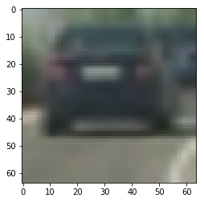
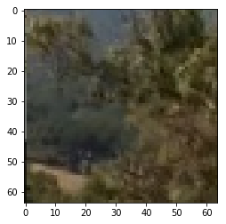
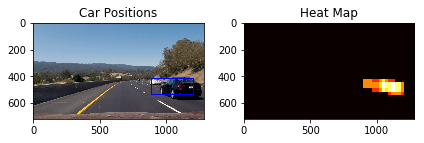

**Vehicle Detection Project**

The goals / steps of this project are the following:

* Perform a Histogram of Oriented Gradients (HOG) feature extraction on a labeled training set of images and train a classifier Linear SVM classifier
* Added a color transform and append binned color features, as well as histograms of color, to your HOG feature vector. 
* Implement a sliding-window technique and use your trained classifier to search for vehicles in images.
* Run your pipeline on a video stream (start with the test_video.mp4 and later implement on full project_video.mp4) and create a heat map of recurring detections frame by frame to reject outliers and follow detected vehicles.
* Estimate a bounding box for vehicles detected.

[//]: # (Image References)

###Histogram of Oriented Gradients (HOG)

####1. I have extracted hog features in cell 6 of my notebook

I then explored different color spaces and different `skimage.hog()` parameters (`orientations`, `pixels_per_cell`, and `cells_per_block`).  I grabbed random images from each of the two classes and displayed them to get a feel for what the `skimage.hog()` output looks like.

####2. Explain how you settled on your final choice of HOG parameters.

I tried various combinations of parameters and found that hog with hist and spatial bins gave me the best output, most of my outputs are saved in pickle files for you too try later

####3. I trained a linear SVM in cell 9 using extracted features from above step 

I also tried GridSearchCV which is commented out in earlier cells

###Sliding Window Search

####1. I implimented sliding search in cell 12 and 13

####2. Show some examples of test images to demonstrate how your pipeline is working.  What did you do to optimize the performance of your classifier?

Ultimately I searched on two scales using YCrCb 3-channel HOG features plus spatially binned color and histograms of color in the feature vector, which provided a nice result.  Here are some example images:

---

### Video Implementation

####1. Video
Here's a [link to my video result](outputNew.mp4)

####2. I implemnted filter for false positives in cell 6 and cell 7 w

I recorded the positions of positive detections in each frame of the video.  From the positive detections I created a heatmap and then thresholded that map to identify vehicle positions.  I then used `scipy.ndimage.measurements.label()` to identify individual blobs in the heatmap.  I then assumed each blob corresponded to a vehicle.  I constructed bounding boxes to cover the area of each blob detected.  

###Discussion

####1. Briefly discuss any problems / issues you faced in your implementation of this project.  Where will your pipeline likely fail?  What could you do to make it more robust?

I need to comeup with a better algo to avoid false positives, and also fit a proper bounding box.

